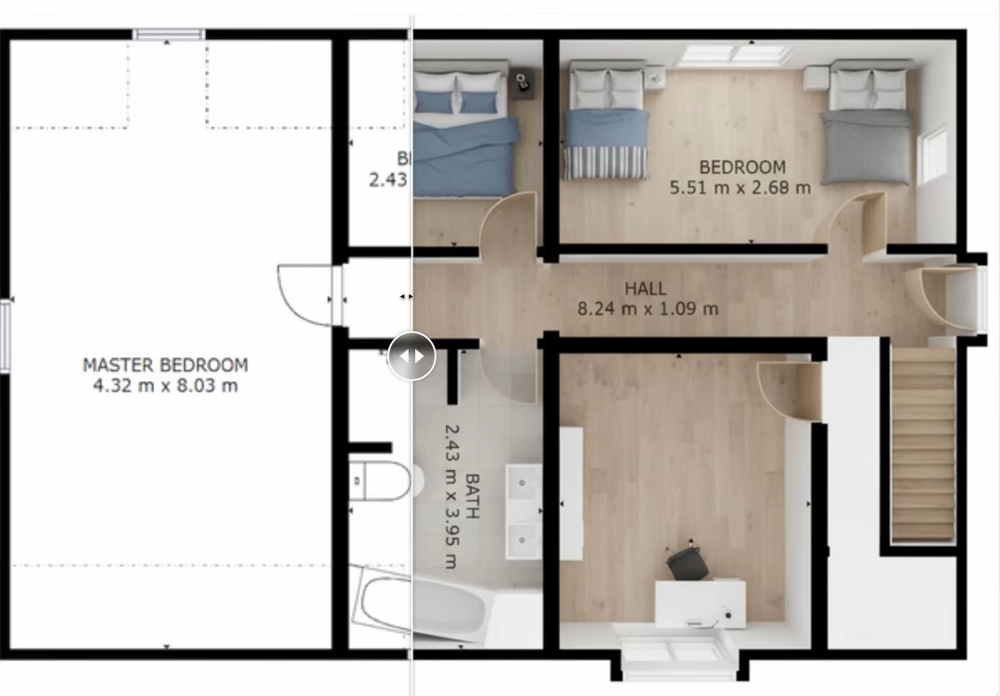

# TerraForma

<div style="display:flex">
  
  
  
  
  
  
  
</div>

<br />

> **AI-powered architectural visualization SaaS built with React, TypeScript, and Puter. Transform 2D floor plans into photorealistic 3D renders with permanent hosting and persistent metadata.**

<div>
  <br />
  <div align="center">
      
  </div>
  <br />
</div>


## 📖 Table of Contents

- [About](#about)
- [Features](#features)
- [Quick Start](#quick-start)
- [Installation](#installation)
- [Usage](#usage)
- [API Reference](#api-reference)
- [Contributing](#contributing)
- [License](#license)

## 🏗️ About

TerraForma is an AI-powered architectural visualization application that transforms 2D floor plans into stunning 3D renders. Built with modern web technologies and powered by AI models from Claude to Gemini, this application provides a seamless experience for architects, designers, and visualization enthusiasts.

### Core Capabilities

- **2D-to-3D Transformation**: Instant architectural rendering using state-of-the-art AI
- **Persistent Storage**: Permanent file hosting with public URL generation
- **Project Management**: Dynamic gallery with metadata persistence
- **Community Features**: Global feed for sharing and discovering projects
- **Privacy Controls**: Granular public/private toggles for project visibility

## ⚡ Features

### For Users

- **Instant Visualization**: Upload floor plans and get photorealistic 3D renders in seconds
- **Project Library**: Organized workspace to track all your visualizations
- **Side-by-Side Comparison**: Interactive tools to compare source and rendered images
- **Easy Sharing**: Download renders or share them with a single click
- **Privacy Management**: Control who can see your projects

### For Developers

- **Modern Tech Stack**: React, TypeScript, TailwindCSS, and Vite
- **Cloud Integration**: Puter platform for serverless workers and storage
- **Type Safety**: Full TypeScript support for reliable development
- **Component Architecture**: Reusable components with clear separation of concerns

## 🚀 Quick Start

### Prerequisites

- Git
- Node.js (version 16 or higher)
- npm (version 8 or higher)

### Installation

1. **Clone the repository:**
   ```bash
   git clone https://github.com/den319/terraforma
   cd terraforma
   ```

2. **Install dependencies:**
   ```bash
   npm install
   ```

3. **Set up environment variables:**
   
   Create a `.env` file in the project root:
   ```env
   VITE_PUTER_WORKER_URL=""
   ```
   
   Replace the placeholder with your Puter worker URL. Get credentials at [Puter.com](https://puter.com).

4. **Start the development server:**
   ```bash
   npm run dev
   ```

5. **Open your browser:**
   Navigate to `http://localhost:3000`

## 📖 Usage

### For End Users

1. **Sign Up**: Create an account to access all features
2. **Upload Plans**: Drag and drop your 2D floor plan images
3. **View Results**: See your 2D plans transform into 3D renders
4. **Manage Projects**: Organize, share, and download your visualizations

### For Developers

#### Project Structure

```
terraforma/
├── app/                    # Main application code
│   ├── app.css            # Global styles
│   ├── root.tsx           # Root component
│   └── routes/            # Page routes
├── components/            # Reusable components
│   ├── Navbar.tsx         # Navigation component
│   ├── Upload.tsx         # File upload component
│   └── ui/               # UI component library
├── lib/                   # Utility functions and services
│   ├── ai.action.ts       # AI integration logic
│   ├── puter.action.ts    # Puter API interactions
│   ├── utils.ts          # Helper functions
│   └── constants.ts      # Application constants
└── public/               # Static assets
```

#### Key Components

- **Upload Component**: Handles file uploads and AI processing
- **Visualizer**: Displays 3D renders with comparison tools
- **Navbar**: Navigation and user management
- **AI Actions**: Integration with Claude and Gemini APIs

## 🔧 API Reference

### Environment Variables

| Variable | Description | Required |
|----------|-------------|----------|
| `VITE_PUTER_WORKER_URL` | Puter worker URL for cloud functions | Yes |

### AI Models

TerraForma supports multiple AI models for image generation:

- **Claude**: Anthropic's advanced language model
- **Gemini**: Google's state-of-the-art AI model

### Storage

- **Puter Storage**: Permanent file hosting with public URLs
- **KV Storage**: Key-value database for metadata persistence
- **Worker Functions**: Serverless functions for AI processing

## 🤝 Contributing

### Development Setup

1. Fork the repository
2. Create a feature branch: `git checkout -b feature-name`
3. Make your changes
4. Run tests: `npm test`
5. Commit your changes: `git commit -m 'Add feature'`
6. Push to the branch: `git push origin feature-name`
7. Submit a pull request

### Code Style

- Use TypeScript for type safety
- Follow React best practices
- Use TailwindCSS for styling
- Write clear, descriptive commit messages

## 📄 License

This project is licensed under the MIT License - see the [LICENSE](LICENSE) file for details.

